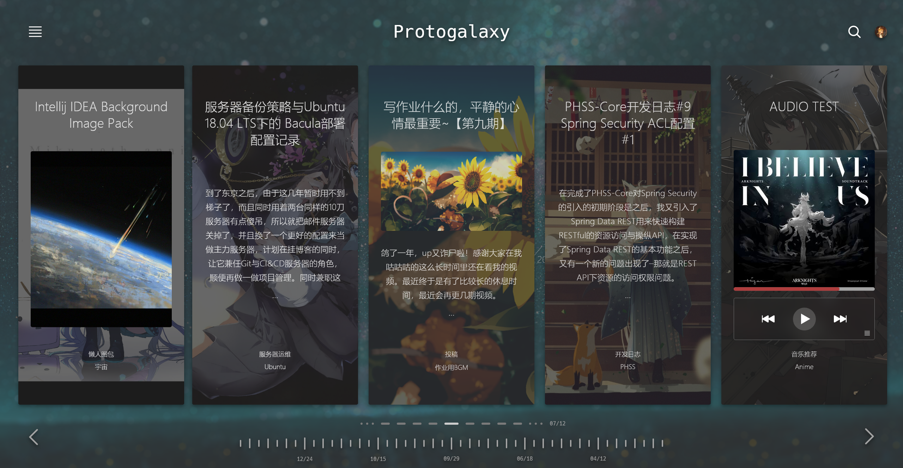
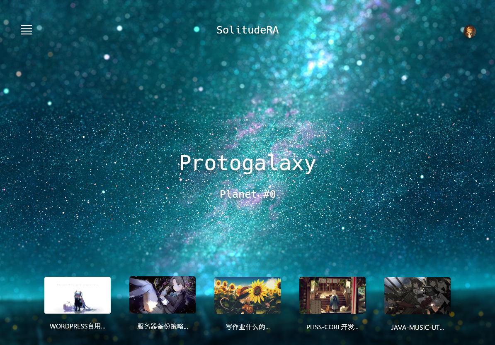
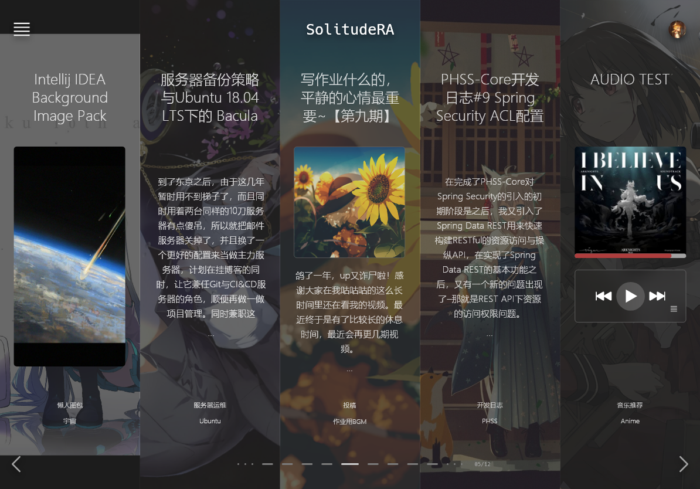
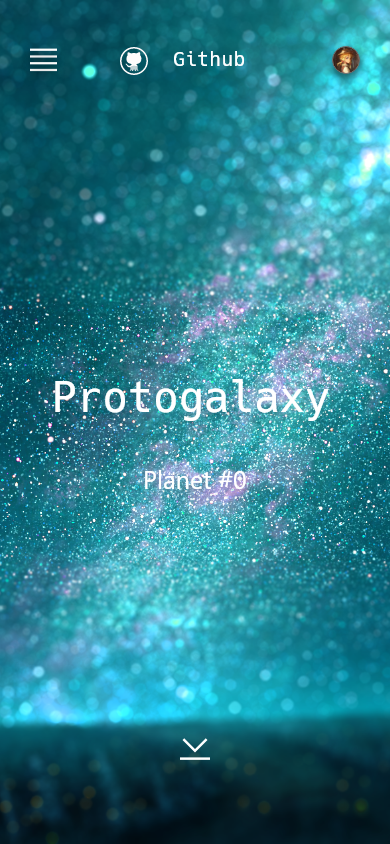
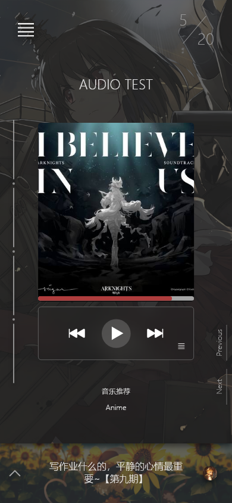

# Solitude Blueprint

## Project Background

**Solitude Blueprint** is a multi-device responsive front-end design for my personal blog, aimed at providing a clean, calm, and modern browsing experience. Supporting desktop, tablet, and mobile devices, this design allows users to effortlessly access articles, images, audio, and other content. Solitude Blueprint uses a modular layout and clear visual hierarchy, creating a structure that is both visually appealing and scalable, aligning well with the needs of a personal blog.

----

### Preview

#### Desktop

<table> 
    <tr>
        <td></td> 
        <td></td> 
    </tr> 
</table>

#### Tablet

<table> 
    <tr> 
        <td></td> 
        <td></td> 
    </tr> 
</table>

#### Mobile

<table> 
    <tr> 
        <td></td> 
        <td></td> 
        <td></td> 
    </tr> 
</table>

---

## Design Concept

### 1. Visual Consistency and Brand Tone
- **Simplicity and Modernity**: Solitude Blueprint employs a minimalist card-based layout with a dark color scheme, creating a calm and elegant visual effect that aligns with a contemporary, focused blog atmosphere.
- **Content-Background Separation**: Soft contrasting colors help separate content from the background, ensuring that information is presented clearly without excessive visual distractions, while maintaining an overall cohesive design.
- **Modular Layout**: Content is presented in a unified card style across the platform, ensuring consistent visuals across different devices, and allowing for future content expansion and layout adjustments.

### 2. Information Architecture and Content Hierarchy
- **Clear Content Hierarchy**: Each card is structured to prioritize information, with titles, category tags, and short descriptions displayed in order of importance, helping users quickly understand content topics and enhancing readability.
- **Modular Information Structure**: The homepage uses modular sections like "Recommended," "Popular," and "Latest" to guide users to key content, ensuring a clean and organized information structure that makes it easy for users to find and explore.

### 3. User Experience (UX) Design
- **Intuitive Page Layout**: The overall page structure is straightforward, allowing users to quickly locate content, reducing browsing friction.
- **Visual Guidance**: Font size, color, and spacing are used to guide users' attention through the page, clarifying the browsing path and helping users focus on primary content.
- **Potential for Personalization**: The design concept considers the possibility of personalized content recommendations (e.g., based on browsing history or user preferences) to increase user engagement and retention.

### 4. Responsive Design for Multi-Device Compatibility
- **Adaptive Layout**: A responsive grid layout is used for different devices, with desktops prioritizing content density for more information, while mobile layouts emphasize readability.
- **Mobile Optimization**: Adjustments are made to card layouts, font sizes, and spacing on mobile to ensure an optimal reading experience.

## Layer Design Overview

### 1. Layer Division
Each frontend component is assigned to a specific layer based on its function, from the lowest to the highest display priority. The main layers include:
- **Background Layer**: Provides a static background that acts as the visual foundation of the page.
- **Content Layer**: The core area for displaying blog content such as articles, images, and code.
- **Static UI Layer**: Houses non-interactive UI elements like the navigation bar and footer.
- **Interactive Layer**: Contains dynamic components that respond to user actions, such as buttons for likes, comments, or other forms of interaction.
- **Popup Layer**: Displays floating or modal content, bringing attention to elements that need to stand out, like image previews or content menus.
- **Top Notification Layer**: Used for critical notifications or alerts, appearing above all other content to capture the user’s focus.

### 2. Shadow and Layer Height Design
Each layer is assigned a unique shadow effect, with progressively deeper and softer shadows to create a visual "depth" or "closeness" to the user’s perspective. This layered shadowing effect helps users quickly understand the relative positioning of elements on the page. Higher-priority elements, like popup or notification layers, typically have more prominent shadows to distinguish them from the main content and emphasize their importance.

### 3. Dynamic Interaction Effects
Layers can dynamically respond to user interactions. For instance, clicking a button can trigger a popup window, a navigation menu, or an important notification. These popups and notifications are placed on higher layers to ensure they remain visually distinct and central to the user’s attention. Additionally, these layers can feature animations, such as sliding or fading effects, to make transitions between layers smooth and natural.

### 4. Usage Scenarios
- **Content Display**: Core content, like article text, is placed on lower layers to provide a stable reading experience without distractions.
- **Navigation and Interaction**: Static UI elements, such as navigation bars, are layered just above the content, making navigation easily accessible without interfering with the main content.
- **Floating and Notifications**: Popups and top notifications are positioned on the highest layers, ensuring immediate visibility for alerts or confirmation messages, with shadows that clearly separate them from other content.